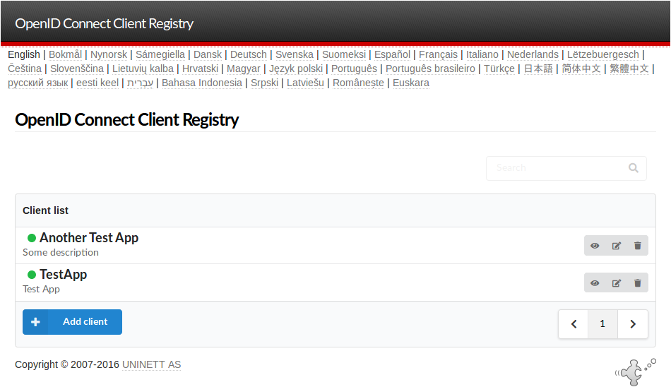

# SimpleSAMLphp Module OIDC

> A SimpleSAMLphp module for OIDC OP support.

## Documentation
To get started, refer to module [documentation](docs/1-oidc.md).

## Authors & Acknowledgements

### Original Author
* **Sergio Gómez** ([Universidad de Córdoba](https://www.uco.es) / [RedIRIS](https://www.rediris.es)) — Initial author and creator of the module.
In 2021, the module was transfered to the official SimpleSAMLphp organization.

### Maintainers & Core Contributors
* **Marko Ivančić** ([SRCE - University Computing Centre, University of Zagreb](https://www.srce.unizg.hr))
* **Patrick Radtke** ([Cirrus Identity](https://www.cirrusidentity.com))

Big chunk of work on the module is or was supported by the **GÉANT Trust & Identity Incubator** project,
funded by the European Union. 

### Supported By

  
  
  
  
  

